# Введение

`	`Целью данной курсовой работы была автоматизация складского учета. Склад – это здание или сооружение, предназначенное для приема, размещения и хранения, поступивших на него товаров, подготовки их к потреблению и отправки потребителю. С быстрым увеличением объемов хранилища, а также с усложнением процессов в нынешнее время, простой складской учет не может обеспечить нормальную деятельность склада и поэтому требует автоматизации. 

`	`Данная система позволит просмотреть все товары, которые хранятся на складе, место хранения каждого товара, а также всю другую дополнительную информацию о товаре. Система сможет производить поиск по всей базе товаров в соответствии с выбранным критерием поиска. В системе можно будет внести изменения для каждого товара, а также составлять накладные для отправки товаров заказчику. Система будет сама распределять товар по складу, а именно подбирать наиболее удобное место хранения и сообщать об этом пользователю. 

`	`Безусловно, данная система намного облегчит работу персонала, за счет быстрого доступа к каждой единице склада, а также сделает весь процесс работы более удобным и наглядным.  

`	`Для автора данная система складского учета поможет сформировать навык практической работы, связанной с проектированием и разработкой человеко-машинного интерфейса, а также поможет освоить общий методологический подход, используемый для проектирования человеко-машинного интерфейса. 

# Система складского учета Stock room
1. # Анализ предметной области
   1. ## Требования к системе 

`	`Для автоматизации складского учета необходимо реализовать все операции, связанные с товарами: приход товара, распределение нового товара по складу, поиск товара (получение расположения на складе), пересмотр каталога товаров с возможностью изменить любые поля каждого товара, составление накладных на отгрузку товара со склада заказчику. 

`	`В системе складского учета о каждом товаре или продукте будет хранится информация: id в виде индивидуального номера (int), название (String), вес в килограммах (Double), дата прибытия на склад (Data), объем товара в метрах кубических (Double), хрупкость товара в процентном виде % (int), описание товара (String), место на складе в виде строки, которая будет состоять из двух частей: буквенной и цифирной, три буквы означают ряд на территории склада, а цифры — это порядковое место на складе (String). Пример: *abc1234. [1]*

1. ## Основной функционал системы

`	`Для того, чтобы зарегистрировать пришедший товар на склад, администратор должен будет внести информацию о товаре в поля, кроме id и места на складе, так как эти данные будут сами генерироваться системой, для обеспечения уникальности этих данных. Система будет подбирать подходящее место на складе и выдавать это место администратору для дальнейшей транспортировки товара. Пришедший товар за рабочую смену необходимо хранить в истории регистрации товаров, для того, чтобы полностью разместить товар за текущую рабочую смену. При следующим заходе в систему история будет очищена.

`	`Поиск товара по складу необходимо реализовать с целью получить место товара, для дальнейших действий. Поиск нужно реализовать с возможностью выбора критерия поиска (id, название, хрупкость и т.д.), а также возможности поиска без критерия. В таком случае поиск будет производиться по всем полям товара. Система пройдется по базе товаров и выведет список товаров с совпадениями. После выбора конкретного товара система выдаст место.

`	`Пересмотр каталога товаров (ревизия) подразумевает возможность изменить данные о любом товаре на складе, выбрав определенный товар администратор может внести изменения и сохранить. Изменения сохранятся в базе. Администратор можем изменить все поля, кроме id, так это индивидуальный номер каждого товара.  

`	`Система складского учета будет позволять создавать накладную на отправку товара, списка товаров для отправки заказчику. Из каталога необходимо будет перенести товар в накладную, заполнить поля заказчика, а также дату создания накладной. После отгрузки товар будет выгружен со склада и удален из базы данных. 

`	`На основе данных требований и предложенного функционала попытаемся определить действующих лиц, варианты использования и написать глоссарий, который поможет однозначно интерпретировать их.

1. ## Глоссарий

Таблица 1. Глоссарий проекта

|**Термин**|**Значение**|
| - | - |
|Управляющий|Администратор системы, который отвечает за общее состояние склада, и которому доступен весь функционал системы складского учета. |
|Персонал|Пользователь системы, которому доступна функция поиска товара на складе.|
|Id|Уникальный идентификационный номер товара.|
|Хрупкость (степень хрупкости)|Число от 0 до 100, означающая меру разрушения товара при воздействии на него. |
|Габариты |Размеры товара|
|Место на складе|Строка, которая олицетворяет место хранения товара, вида ***abc1234,*** которая будет состоять из двух частей: буквенной и цифирной, три буквы означают ряд на территории склада, а цифры — это порядковое место на складе|
|Критерий поиска|Одно из полей товара, по которому будет произведен поиск. |
|Каталог товаров|Список товаров, содержащихся на складе в данный момент времени|
|Ревизия|Пересмотр каталога товаров, с возможностью внести изменения|

1. ## Действующие лица

`	`Администратор – управляющий склада, доступен весь функционал. 

`	`Поисковая система – производит поиск внутри локальной базы данных и выдает информацию.

`	`Пользователь – персонал склада, которому доступна функция поиска товара по складу. 

1. ## Варианты использования

В результате анализа предметной области были выделены следующие варианты использования:

- Вход в систему
- Зарегистрироваться в системе
- Зарегистрировать пришедший товар
- Определить место хранения товара на складе (поиск)
- Провести ревизию товара 
- Отгрузить товар по составленной накладной

1. ### ` `Вход в систему

Краткое описание:

`	`Данный вариант использования описывает вход пользователя в систему. Пользователем может быть либо администратор системы, управляющий склада, который имеет доступ ко всему функционалу системы, либо персонал склада, которому доступен ограниченный функционал. 

Основной поток:

1. Система запрашивает логин и пароль
1. Пользователь вводит логин и пароль
1. Система сверяет данные с базой пользователей, после чего открывается соответствующий доступ в систему. 
1. Запускается один из двух потоков: Администратор, Пользователь.

Альтернативные потоки: 

Неправильный логин/пароль 

`	`Если во время выполнения основного потока обнаружится, что пользователь ввел неправильный логин/пароль, поля логина и пароля не заполнены, то система выведет сообщение об ошибке. Пользователь может вернуться к началу основного потока или отказаться от входа в систему, при этом выполнение варианта использования завершится

Зарегистрироваться в системе

`	`Если необходимо зарегистрировать новый персонал склада, то перейдя по гиперссылке начнется выполнение варианта использования «Зарегистрироваться в системе»

1. ### ` `Зарегистрироваться в системе

Краткое описание:

`	`Данный вариант использования описывает регистрацию работника в системе. 

Основной поток:

1. Система предлагает заполнить поля с новым логином и паролем.
1. Пользователь заполняет необходимые формы. 
1. Пользователь нажимает на кнопку «Зарегистрировать»
1. Система считывает данные с полей
1. Система сверяет новый логин с базой пользователей, и, если не находит совпадений, создает нового пользователя, и заносит его данные в базу.
1. Система переводит пользователя на поток «Вход в систему»

Альтернативные потоки: 

Необходимые поля не заполнены

`	`Если во время выполнения основного потока обнаружится, что после нажатия на кнопку «Зарегистрировать» пользователь не заполнил необходимые поля, то система выдаст ошибку, с просьбой заполнить необходимые поля. 

Пользователь с таким логином уже существует

`	`Если во время выполнения основного потока обнаружится, что после нажатия на кнопку «Зарегистрировать» пользователь ввел логин, который занят другим пользователем, то система выдаст ошибку с просьбой изменить логин и перейдет в начало выполнения основного потока.

1. ### Поток Администратор

Краткое описание:

`	`Поток администратора выполняется при входе в систему управляющего. 

Основной поток:

1. Система предлагает на выбор выполнение следующих потоков:
- Зарегистрировать пришедший товар
- Определение места хранения на складе (поиск)
- Провести ревизию товара
- Отгрузить товар по составленной накладной

Альтернативный поток: 

При желании администратор может выйти из данного потока нажав выход. 

1. ### Поток Пользователь 

`	`Поток пользователя выполняется при входе в систему персонала.

Основной поток:

1. Система переводит пользователя на поток:
- Определение места хранения товара на складе (поиск)

Альтернативный поток: 

При желании пользователь может выйти из данного потока нажав выход. 

1. ### Зарегистрировать пришедший товар

Краткое описание:

`	`Данный вариант использования описывает процесс добавления товара на склад, выполняется, когда администратор авторизовался в системе и нажал на кнопку «Регистрация нового товара»

Основной поток:

1. Система предлагает ввести следующие данные о новом товаре: наименование товара, вес, дата, объем, хрупкость, описание. 
1. Администратор вводит необходимые данные, учитывая то, что все поля обязательны для заполнения. 
1. Система создает в базе новый товар в соответствии с веденными данными. 
1. Система присваивает товару id.
1. В соответствии с веденными данными, система подбирает наиболее удобное и безопасное место хранения и выдает администратору строку, которая означает место на складе.
1. Система добавляет данный товар в историю регистрации рабочей смены. 

Альтернативные потоки: 

Необходимые поля не заполнены

`	`Если во время выполнения основного потока обнаружится, что после нажатия на кнопку «Зарегистрировать товар» администратор не заполнил необходимые поля, то система выдаст ошибку, с просьбой заполнить необходимые поля. 

`	`При желании администратор может выйти из данного варианта использования нажав на кнопку «Вернуться в главное меню». 

`	`При желании администратор может очистить все поля заполнения нажав на кнопку «очистить»

1. ### Определение места хранения товара на складе (поиск)

Краткое описание:

`	`Данный вариант использования описывает поиск товара по всему складу. Вариант использования доступен как администратору, так и пользователю, выполняется при входе в систему пользователя (персонала), или если администратор нажмет на кнопку «Найти товар на складе». 

Основной поток:

1. Система предлагает выбрать по какому критерию будет произведен поиск (название товара, вес, хрупкость и т. д.)
1. Пользователь выбирают способ поиска.
1. Система предлагает ввести данные поиска. 
1. Пользователь вводит соответствующие данные.
1. Система выдает в качестве промежуточного результата список товаров, которые прошли сортировку и предлагает пользователю выбрать нужный товар. 
1. Система выдает в качестве конечного результата место товара на складе.

Альтернативные потоки: 

`	`При желании администратор может выйти из данного варианта использования нажав на кнопку «Вернуться в главное меню».

`	`При желании пользователь может очистить поле поиска нажав на кнопку «очистить»

`	`При желании пользователь может завершить работу нажав на кнопку «Завершить».

1. ### Провезти ревизию товара

`	`Данный вариант использования позволяет администратору изменить любые характеристики любого товара на складе, выполняется, когда администратор в главном меню нажмет на кнопку «Просмотреть каталог товаров». 

Основной поток:

1. Система предоставляет пользователю весь каталог товаров, которые хранятся на складе в данный момент времени. 
1. Выбрав определенный товар, все характеристики товара дублируются в соседней сцене. 
1. Система предлагает изменить характеристики товара. 
1. Нажав на кнопку изменить, откроется дополнительное окно. 
1. Все данные дублируются в полях, и администратор может внести изменения в каждом поле, кроме поля id. 
1. Нажав на кнопку «сохранить» все данные о товаре обновятся и изменения занесутся в базу. 

Альтернативные потоки: 

Необходимые поля не заполнены

`	`Если во время выполнения основного потока обнаружится, что после нажатия на кнопку «Сохранить» администратор не заполнил необходимые поля, то система выдаст ошибку, с просьбой заполнить необходимые поля. 

`	`При желании администратор может выйти из дополнительного окна нажав на кнопку «Отмена»

`	`При желании администратор может выйти из данного варианта использования нажав на кнопку «Вернуться в главное меню».

`	`При желании Администратор может завершить работу нажав на кнопку «Завершить».

1. ### Отгрузить товар по составленной накладной

`	`Данный вариант использования позволяет администратору составить накладную и отгрузить товар по ней, выполняется, когда администратор в главном меню нажмет на кнопку «Выгрузить товар со склада» 

Основной поток:

1. Система предоставляет пользователю весь каталог товаров, которые хранятся на складе в данный момент времени. 
1. Выбрав определенный товар, и нажав на кнопку «Перенести в накладную» товар будет перемещен в накладную.
1. Система предлагает ввести информацию о заказчике, а также дату составления накладной. 
1. Нажав на кнопку «Отгрузить товар», система удалит данные о товарах из каталога товаров и выведет информация о накладной: Заказчик, дата, кол-во товаров. 

Альтернативные потоки: 

Необходимые поля не заполнены

`	`Если во время выполнения основного потока обнаружится, что после нажатия на кнопку «Отгрузить товар» администратор не заполнил необходимые поля, то система выдаст ошибку, с просьбой заполнить необходимые поля. 

В накладной нет товаров

`	`Если во время выполнения основного потока обнаружится, что после нажатия на кнопку «Отгрузить товар» в накладной нет товаров, то система сообщит об этом администратору с просьбой добавить товары в накладную.

`	`При желании администратор может очистить накладную нажав на кнопку «Очистить накладную», все товары будут перенесены обратно в каталог. 

`	`При желании администратор может выйти из данного варианта использования нажав на кнопку «Вернуться в главное меню».

`	`При желании Администратор может завершить работу нажав на кнопку «Завершить».

1. ## Выбор программного средства реализации

`	`Для разработки системы нам потребуется среда разработки, в моем случае – IntelliJ IDEA.

`	`Для создания Java программ и их последующей отладкой, библиотека для работы с графическим интерфейсом JavaFX [1]

`	`Для быстрого создания интерфейса приложения будем использовать визуальный инструмент дизайна JavaFX Scene Builder.[2]

1. # Реализация системы
   1. ## Хранение данных 

Из вариантов использования мы можем сделать вывод, что для реализации базы данных склада нам необходимы два текстовых файла которые будут хранить информацию о всех продуктах и всех пользователях.  

`	`Данные в файлах будут храниться построчно и разделены знаком ‘/’. 

Catalog.txt – текстовый файл, который хранит всю информацию о всех товарах на складе. В каждой строке указан: id, наименование, вес, дата, объем, хрупкость, описание, место. 

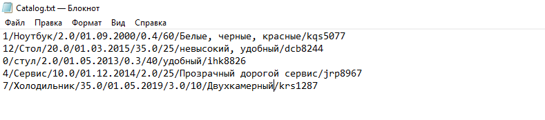

Рисунок 1. Структура хранения информации товаров

Users.txt – текстовый файл, который хранит всю информацию о пользователях системы. В каждой строке указан: логин, пароль, булевская переменная, которая показывает, кем является данный пользователь, управляющий или персонал. 

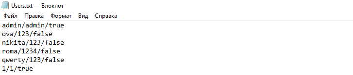

Рисунок 2 Структура хранения информации о всех пользователях

1. ## Классы системы
   1. ### Класс Product

Класс Product описывает одну единицу товара.

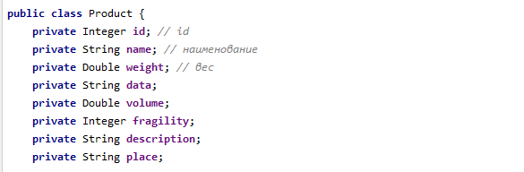

Рисунок 3 Поля класса Product

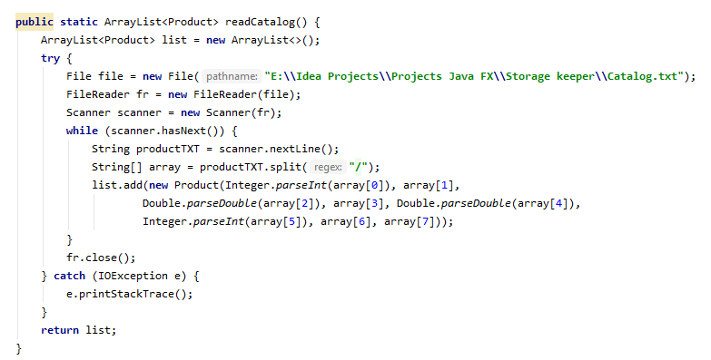

Рисунок 4 Статический метод возвращающий список товаров, из файла

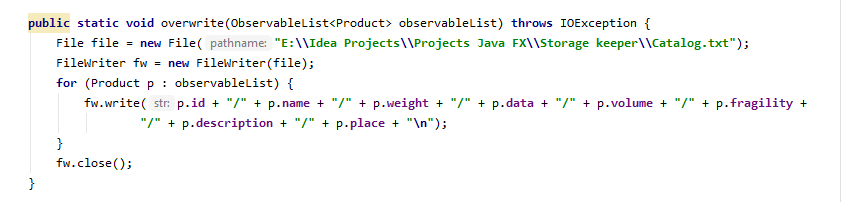

Рисунок 5 Статический метод перезаписи файла Catalog.txt

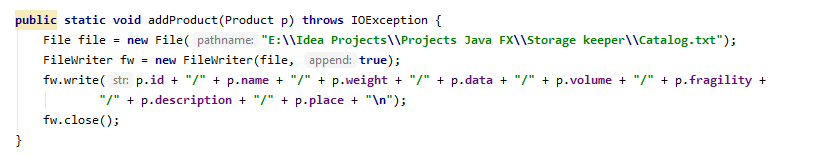

Рисунок 6 Статический метод добавления нового товара в файл

1. ### Класс User

Этот класс описывает каждого пользователя системы. 

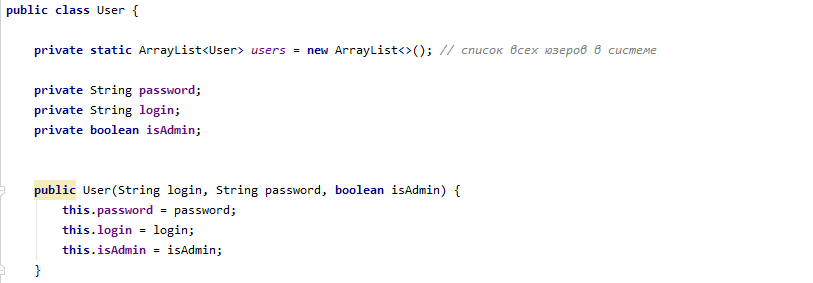

Рисунок 7 Переменные класса User и конструктор

Рисунок 8 Метод добавления пользователя в список всех пользователей

Данный метод срабатывает, когда регистрируется новый пользователь.

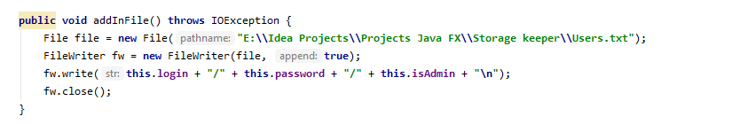

Рисунок 9 Метод добавления пользователя в файл

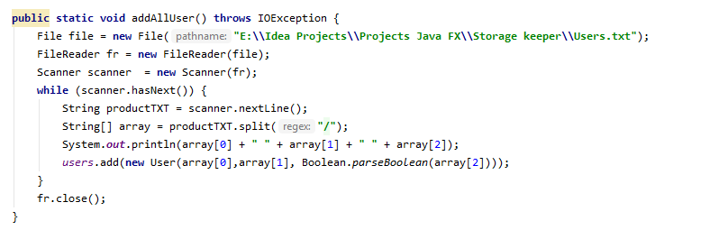

Рисунок 10 Метод добавления всех пользователей из файла с список

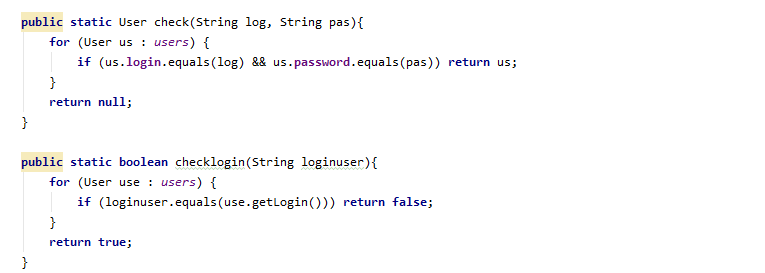Рисунок 11 Методы проверки логинов и паролей

1. ## Структура системы

`	`Для быстрой навигации в проекте все файлы были размещены по группам (Рисунок 12). Все fxml-файлы, которые были созданные в Scene Builder, помещены в папку «fxml». Каждый из этих файлов связан со своим контроллером, в котором прописана логика сцены. В папке picture хранятся все изображения, которые были использованы в качестве картинок и фонов. 

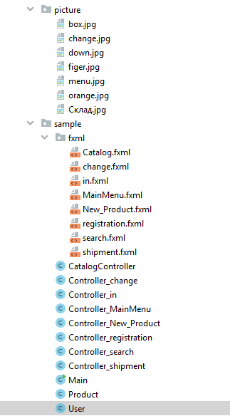

Рисунок 12 Структура проекта

1. ## Создание пользовательского интерфейса системы
   1. ### Фон 

	В качестве фона были взяты изображения с оранжевым оттенком, который помогает сконцентрироваться на работе. [1]

Рисунок 13 Основной фон проекта
1. ### Структура пользовательского интерфейса и справочная система

`	`При запуске системы первое окно, которое видит пользователь – это окно входа. (Рисунок 14) 

Рисунок 14 Окно входа

Если пользователь захочет зарегистрироваться в системе и нажмет гиперссылку «Зарегистрироваться», то откроется окно регистрации. (Рисунок15)

Рисунок 15 Окно регистрации нового пользователя

После входа администратора в систему появляется основное меню, в котором администратор может выбрать необходимые действия. (Рисунок 16)

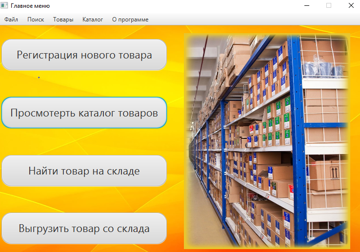

Рисунок 16 Главное меню

При нажатии на кнопку регистрации нового товара выходит окно регистрации товара, функционал которого описан в одном из вариантов использования (Зарегистрировать пришедший товар) (Рисунок 17)

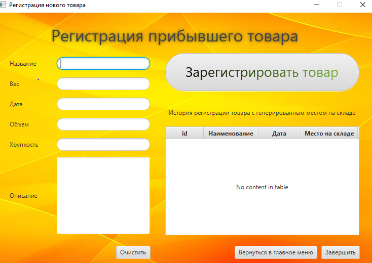

Рисунок 17 Окно регистрации нового товара

При нажатии на кнопку просмотреть каталог товаров выходит окно всего каталога, функционал которого описан в одном из вариантов использования (Провести ревизию товара) (Рисунок 18)

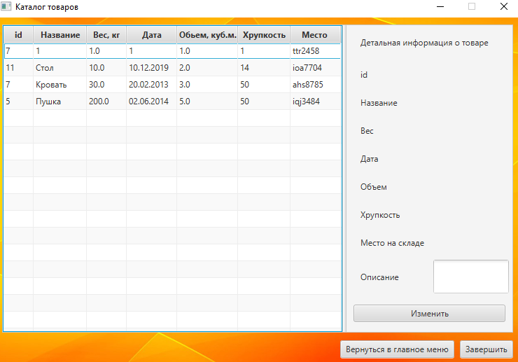

Рисунок 18 Окно каталога товаров

Если пользователь захочет изменить выбранный товар и нажмет на кнопку «изменить», то откроется дополнительное окно Редактирования товара (Рисунок 19)

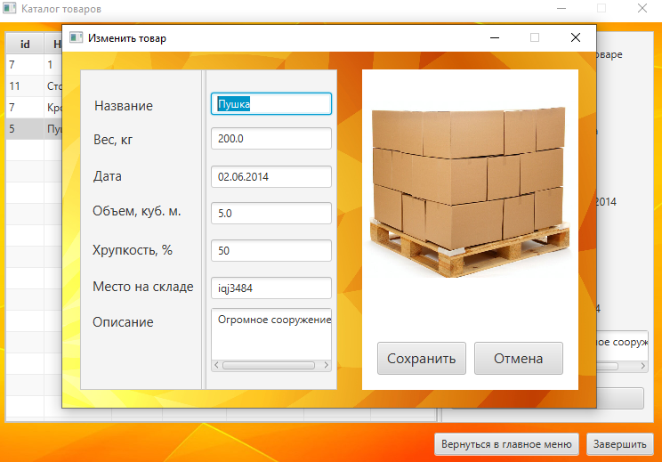

Рисунок 19 Окно редактирования выбранного товара

При нажатии на кнопку «Найти товар на складе» выходит окно поиска, функционал которого описан в одном из вариантов использования (Определение места хранения товара на складе, поиск) (Рисунок 20)

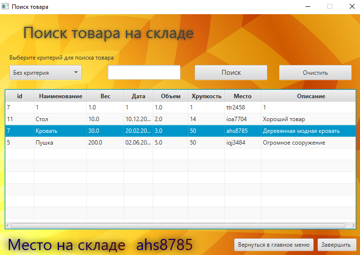

Рисунок 20 Окно поиска товара на складе

При нажатии на кнопку «выгрузить товар со склада» выходит окно поиска, функционал которого описан в одном из вариантов использования (Отгрузить товар по составленной накладной) (Рисунок 21)

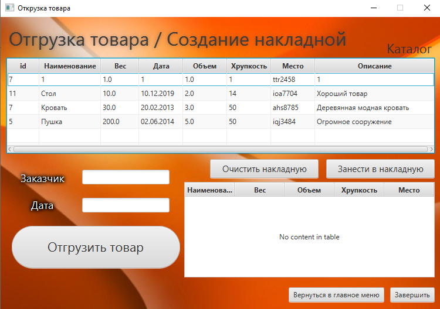

Рисунок 21 Окно отгрузки товара со склада

# Заключение

`	`Таким образом, мы создали систему складского учета, которая впоследствии вполне может служить основой для полноценной системы, которая будет решить задачи и проблемы данной области. Очень важную роль сыграла разработка интерфейса данной системы, так как необходимо было сделать интерфейс максимально понятным и доступным для пользователя. В процессе выполнения данного проекта был освоен общий методологический подход, используемый для проектирования человека-машинного интерфейса. 

PAGE   \\* MERGEFORMAT20

